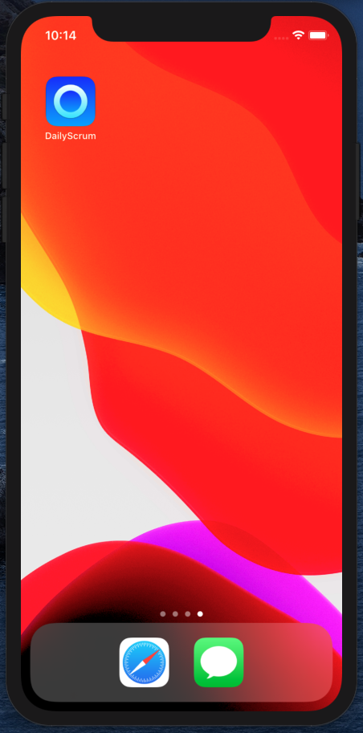

# DailyScrum

## Overview:

A simple iOS application used to help our development stand up meetings.

It provides the following main areas of functionality: 
* Assigns a random order for our developers to give their statuses with easy toggles for when developers are absent.
* Announces the start of each developer's turn and total time taken using the AVSpeechSynthesizer API.
* Times each developer and indicates if they are going over their alloted time (Current Default: 3 minutes).

## Images:

